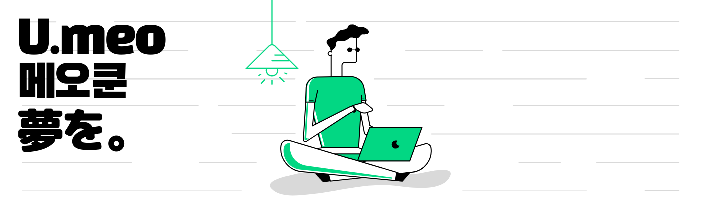
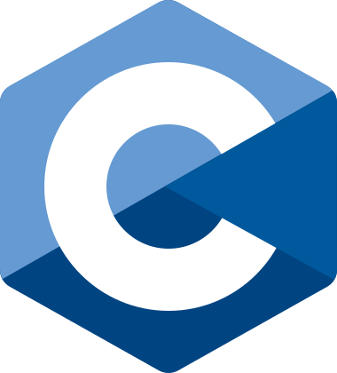
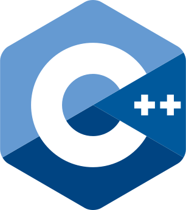
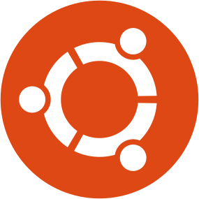

<!--u-meo profile README.md-->

<!--Banner Image-->


<!--Hi Message-->
<h2>Welcome </h2>

---
<!-- State Sentence -->
<h3>I'm U.meo</h3>

<!-- Info about me -->
- 🎓I'm a student at [Hanyang University](https://www.hanyang.ac.kr/web/eng), Korea.  
- ✨I like to explore new technologies.  
- 🧱[Minecraft](https://www.minecraft.net/en-us) is my favourite game.  
- 🌎I can speak Korean(한국어), English, Japanese(日本語)
- 🪖Pre-scheduled military leave will be activated in August 2021 ~ February 2023.

<!-- State Sentence -->
<h3>Team.Infinity</h3>

<!-- Info about team -->
- 🔥I'm working on [Team.Infinity](https://team.hamdan.kr/).

<!-- Language -->
<h3>Language and Stuff</h3>
<a href="https://www.cprogramming.com/" target="_blank">  </a>
<a href="https://www.cprogramming.com/" target="_blank">  </a>
<a href="https://kotlinlang.org/docs/home.html" target="_blank">  </a>
<a href="https://docs.oracle.com/en/java/" target="_blank">  </a>
<a href="https://docs.python.org/3/" target="_blank">  </a>
<a href="https://developer.microsoft.com/en-us/windows/" target="_blank">  </a>
<a href="https://developer.apple.com/" target="_blank">  </a>
<a href="https://ubuntu.com/desktop/developers" target="_blank">  </a>
<a href="https://code.visualstudio.com/" target="_blank">  </a>
<a href="https://www.jetbrains.com/idea/" target="_blank">  </a>

<!-- Info about me -->
<h3>Contact with me</h3>
<a href="yutari01@hanyang.ac.kr" target="blank"></a>
<a href="https://discord.gg/Efuwbk69bp" target="blank"></a>

---
<!-- Stats -->
<h3>📈 Statistics of My Development: </h3>

```text
💬 Developing by: 
Kotlin            2 hours                80.0% 
CSS               30 mins                20.0% 
Other             0 secs                 00.0%

⌚︎ Last Updated on 28/06/2021 
```

<!-- GitHub stats -->
<h3>⚡ My GitHub Statistics<h3>
<p>
<!-- GitHub Stats -->


<!-- Most Used Languages -->

</p>

---
<!-- Friend! -->
<p align="center"><p>
<p align="center">I love talk with different people from around the world,<p>  
<p align="center">so if you want to be my friend, feel free to reach out and introduce yourself😊<p>  
